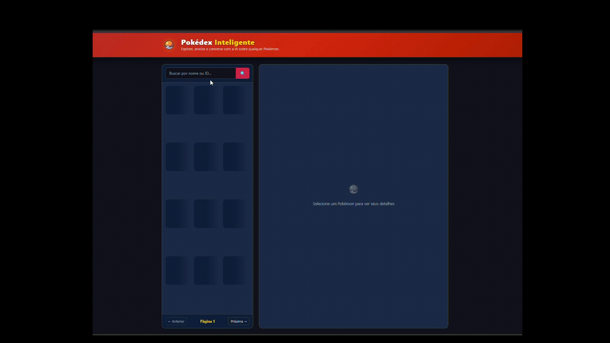

# 🎮 Pokédex Inteligente

Aplicação Full Stack desenvolvida como desafio técnico utilizando FastAPI, HTML, CSS e JavaScript.

A aplicação consome a PokéAPI para disponibilizar informações sobre Pokémon e integra um modelo de linguagem (LLM) via OpenRouter para responder perguntas contextualizadas sobre o Pokémon selecionado.

Desenvolvido por **Thamires dos Santos Candido**.



---

## ✨ Funcionalidades

- 📋 Listagem paginada de Pokémon com imagem e tipos
- 🔍 Busca por nome ou ID
- 📊 Detalhes completos: estatísticas base, habilidades, altura, peso e imagem shiny
- 🤖 Chat com IA: faça perguntas sobre o Pokémon selecionado e receba respostas do Professor Carvalho, powered by LLM via OpenRouter
- 💬 Sugestões de perguntas para facilitar a interação

---

## 🛠️ Stack de Tecnologias

### Backend
| Tecnologia | Versão | Uso |
|---|---|---|
| Python | 3.12+ | Linguagem principal |
| FastAPI | 0.136.3 | Framework web |
| Uvicorn | 0.48.0 | Servidor ASGI |
| httpx | 0.27.0 | Requisições HTTP assíncronas |
| Pydantic | 2.13.4 | Validação de dados e schemas |
| pydantic-settings | 2.2.1 | Gerenciamento de variáveis de ambiente |
| pytest | latest | Testes automatizados |

### Frontend
| Tecnologia | Uso |
|---|---|
| HTML/CSS/JS | Interface do usuário |
| Bootstrap 5.3 | Estilização e responsividade |
| marked.js | Renderização de Markdown no chat |

### APIs Externas
| API | Uso |
|---|---|
| PokéAPI | Dados dos Pokémon |
| OpenRouter | Provedor LLM para o chat inteligente |

---

## 📐 Decisões Técnicas

### Por que FastAPI?
Optei pelo FastAPI por ser um framework moderno para desenvolvimento de APIs em Python e por oferecer recursos que atendiam bem às necessidades deste projeto, como validação automática dos dados com Pydantic, documentação interativa dos endpoints e uma estrutura simples para organizar a aplicação. Isso permitiu focar no desenvolvimento das funcionalidades e na organização do código.

### Arquitetura por Módulos
O backend foi organizado por módulos de domínio (`pokemon` e `chat`), cada um contendo seus próprios arquivos de `router`, `service` e `schemas`. Essa organização separa as responsabilidades de cada funcionalidade, facilita a manutenção do código e torna mais simples a adição de novos módulos no futuro.

### Separação de Responsabilidades
No módulo `pokemon`, a comunicação com a PokéAPI foi isolada em um `client.py`, a transformação dos dados ficou concentrada em um `mapper.py` e a orquestração da lógica de negócio em um `service.py`, mantendo os endpoints (`router.py`) enxutos.

### Schemas Pydantic
Os schemas Pydantic representam apenas os dados expostos pela API da aplicação. Os dados retornados pela PokéAPI são transformados pelo `mapper.py`, evitando o acoplamento direto com a estrutura da API externa.

### Exceções Centralizadas
As exceções da aplicação foram centralizadas em `core/exceptions.py`, permitindo um tratamento consistente dos erros relacionados à PokéAPI e à integração com o LLM. Isso garante mensagens de erro consistentes e evita `HTTPException` espalhadas pelo código.

### Prompt Engineering
O chat com LLM utiliza dois prompts separados:
- **Prompt de sistema**: define o papel do Professor Carvalho e as regras de comportamento do modelo
- **Prompt do usuário**: injeta os dados estruturados do Pokémon como contexto antes da pergunta

Essa abordagem permite que o modelo utilize os dados do Pokémon como contexto antes de gerar a resposta.

### Frontend Desacoplado
O frontend consome exclusivamente os endpoints desenvolvidos no backend, mantendo a PokéAPI e o OpenRouter isolados da camada de apresentação.

---

## 📁 Estrutura de Pastas
```text
Pokedex-Inteligente/
├── backend/
│   ├── app/
│   │   ├── core/
│   │   │   ├── config.py         # Configurações centralizadas via pydantic-settings
│   │   │   └── exceptions.py     # Exceções semânticas centralizadas
│   │   ├── modules/
│   │   │   ├── pokemon/
│   │   │   │   ├── client.py     # Requisições HTTP à PokéAPI
│   │   │   │   ├── mapper.py     # Transformação de dados
│   │   │   │   ├── router.py     # Endpoints REST
│   │   │   │   ├── schemas.py    # Modelos Pydantic
│   │   │   │   └── service.py    # Orquestração
│   │   │   └── chat/
│   │   │       ├── router.py     # Endpoint POST /api/chat/
│   │   │       ├── schemas.py    # ChatRequest e ChatResponse
│   │   │       └── service.py    # Integração com OpenRouter
│   │   └── main.py               # Entrypoint da aplicação
│   ├── tests/
│   │   ├── test_pokemon.py       # Testes do módulo pokemon
│   │   └── test_chat.py          # Testes do módulo chat
│   ├── .env.example              # Exemplo de variáveis de ambiente
│   ├── pytest.ini                # Configuração do pytest
│   └── requirements.txt          # Dependências Python
├── frontend/
│   ├── assets/
│   │   ├── css/
│   │   │   └── style.css         # Estilos customizados
│   │   └── js/
│   │       ├── api.js            # Chamadas HTTP ao backend
│   │       ├── app.js            # Lógica principal e eventos
│   │       └── ui.js             # Manipulação do DOM
│   └── index.html                # Página principal
└── docs/
└── demo.gif                  # Demonstração da aplicação
...
```
---

## 🚀 Como Rodar Localmente

### Pré-requisitos
- Python 3.12+ instalado
- Chave de API do [OpenRouter](https://openrouter.ai)
- Extensão [Live Server](https://marketplace.visualstudio.com/items?itemName=ritwickdey.LiveServer) no VSCode

### 1. Clone o repositório

```bash
git clone https://github.com/thamires-sc/Pokedex-Inteligente.git
cd Pokedex-Inteligente
```

### 2. Configure o ambiente virtual

```bash
# Windows
python -m venv venv
venv\Scripts\activate

# Linux/Mac
python -m venv venv
source venv/bin/activate
```

### 3. Instale as dependências

```bash
cd backend
pip install -r requirements.txt
```

### 4. Configure as variáveis de ambiente

```bash
# Windows
copy .env.example .env

# Linux/Mac
cp .env.example .env
```

Abra o `.env` e preencha sua chave do OpenRouter:

```env
OPENROUTER_API_KEY=sua_chave_aqui
OPENROUTER_MODEL=nvidia/nemotron-3-ultra-550b-a55b:free
```
> **Observação:** Durante o desenvolvimento, a chave fornecida pela levva retornou o erro **"No endpoints available matching your guardrail restrictions and data policy"**. Para validar a integração com o LLM, foi utilizada uma chave própria. Para executar a aplicação, basta informar uma chave válida do OpenRouter no arquivo `.env`.

### 5. Suba o backend

```bash
uvicorn app.main:app --reload
```

O backend estará disponível em `http://127.0.0.1:8000`.  
A documentação Swagger estará em `http://127.0.0.1:8000/docs`.

### 6. Abra o frontend

Abra o arquivo `frontend/index.html` com o **Live Server** do VSCode  
(`botão direito → Open with Live Server`).

O frontend estará disponível em `http://127.0.0.1:5500/frontend/index.html`.

---

## 🧪 Rodando os Testes

```bash
cd backend
pytest tests/ -v
```

---

## 🔌 API

A aplicação disponibiliza os seguintes endpoints:

| Método | Endpoint |
|--------|----------|
| GET | `/api/pokemon` |
| GET | `/api/pokemon/{name_or_id}` |
| POST | `/api/chat` |

Documentação interativa disponível em:

http://127.0.0.1:8000/docs

---

## 🚀 Possíveis Melhorias

- Cache das respostas da PokéAPI para reduzir chamadas externas.
- Histórico de conversas do chat.
- Implementar filtros por tipo de Pokémon.
- Deploy da aplicação.
